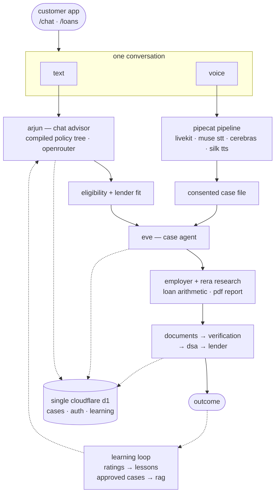

arthiq is a **conversational home-loan planner**, and the start of an operating system for property-loan distribution. a user chats or talks with an ai advisor, gets a personalized eligibility view and lender fit, and is eventually routed to a real dsa who processes the loan. the customer app is deliberately just two screens — chat and loans — because the ai is the interface, never the centerpiece.

## what i built

- **guided discovery + policy fit** — lender policy compiled from source docs into a typescript policy tree. the model sees a compact index and retrieves only relevant nodes, no vector db.
- **case agent** — researches employer and rera registries, runs deterministic loan arithmetic, streams progress live, and renders a pdf case report.
- **voice calls** — a pipecat pipeline over livekit webrtc that reasons on the call and writes a single consented case file at the end. no backend calls mid-call.
- **learning loops** — conversations get rated into operator lessons, and human-approved historical cases form a system-wide rag corpus with shadow/assist modes and holdout evals.
- **trial gate** — 6 free uses shared across chat, voice, and loan creation, with a request-access flow on exhaustion.

## the voice agent

calls run on pipecat over livekit webrtc: silero vad + smart turn endpointing, muse voice transcribe for stt, qwen 27b on cerebras for the spoken loop, rumik silk for tts.

the novel parts are all about turn-taking. silence can't tell "eighty lakh" (finished) from "two point" (not finished), so the guide marks every reply — finished, cut off, or still thinking — and only a finished mark ends the turn. an unfinished turn stays open and the caller's next words join it, so a sentence said in two breaths gets one answer.

transcription is muse, biased to english + hindi, because multilingual deepgram once heard a hindi answer as portuguese and "dwarka" as "walker". but muse endpoints semantically and holds turns open, so we finalize on our own vad and treat its cumulative partials as the text. mid-call the model gets exactly two tools — local emi math and end call — and nothing touches the backend until consent, when one completion extracts the case file and it's written once.

context is compacted before every completion with arithmetic, not a summarizer — a summarizer would cost silence and could invent a figure. and a guard after the llm speaks a fallback line if a response window ever closes empty, so the caller never hears dead air.

## how it fits together

one conversation in, one case file out — then fulfillment and learning underneath.

## why it matters

a home loan is a months-long chain of discovery, documents, verification, and follow-ups — and the product only ever claims readiness, never approval. the interesting work is making that whole chain feel like one calm conversation: text and voice as a single thread, one sticky next action, and a case file that gets smarter every time a loan closes.

<Links
  items={[
    { label: "arthiq.ekaksh.in", href: "https://arthiq.ekaksh.in" },
    { label: "demo", href: "https://youtu.be/_wxe7cxajCI?si=UcuPqEVCCyFko2iV" },
  ]}
/>

<Outcomes
  items={[
    { metric: "chat + voice", label: "one conversation" },
    { metric: "discovery → dsa", label: "eligibility to close" },
    { metric: "live", label: "in production" },
  ]}
/>
