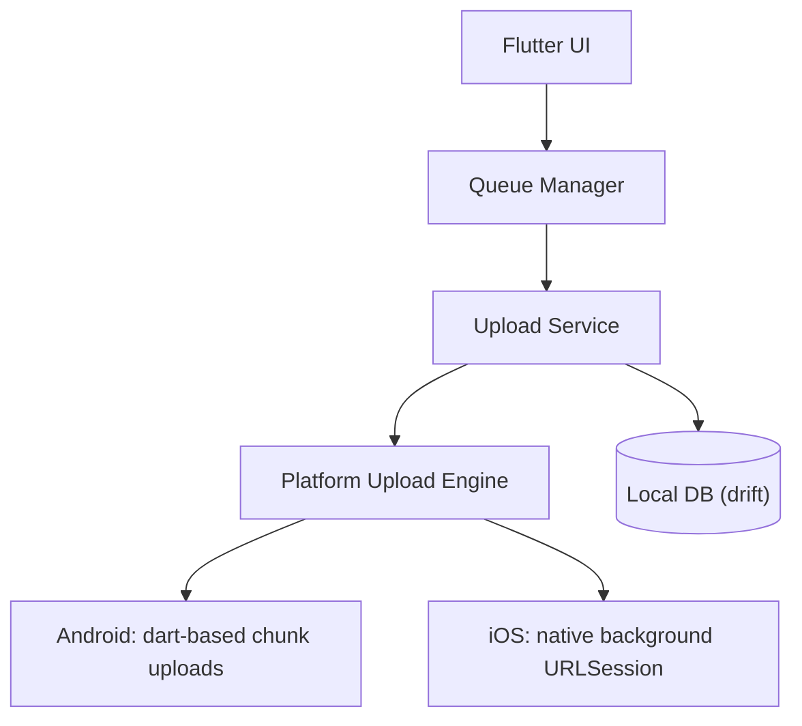

# introduction

uploading a large file from a mobile app seems simple — until you try to make it **reliable**.

on paper, the flow is straightforward:

- pick a file
- send it to the backend
- show a progress bar
- wait for success

but in practice, things are not predictable:

- apps get backgrounded
- processes get killed
- networks drop mid-upload
- if upload state lives in memory, it disappears with the process

<Callout type="note" title="the real shape of the problem">
large uploads are not just a networking problem — they are a **state and recovery problem**.
</Callout>

flutter makes this especially interesting. you get a shared cross-platform application layer, which is great for consistent product features. but the underlying platforms still behave very differently. android and ios have different constraints around **background execution**, **file access**, and **long-running work**, which means upload execution cannot be identical across platforms if reliability is the goal.

while working on large video uploads in a flutter app, i had to design a system that could survive real-world conditions — flaky networks, backgrounding, and partially completed uploads across restarts.

in this post, i will walk through the architecture and key design decisions that made that possible.

## tldr

if upload state lives in memory, it breaks the moment the app is backgrounded or killed. so the system needs to be built around:

<Cards>
  <Card title="db as source of truth" description="not in-memory state" />
  <Card title="resume-first design" description="continue after interruptions" />
  <Card title="queue scheduler" description="one file at a time, parallel chunks" />
  <Card title="adaptive concurrency" description="for unstable mobile networks" />
  <Card title="platform-specific execution" description="dart on android, native on ios" />
</Cards>

<Callout type="tip" title="the mental model">
an upload is not a request — it is a **long-running workflow**. once you treat it that way, reliability becomes a lot easier to reason about.
</Callout>

# high level architecture

once it clicks that large uploads are not a "network problem" but a state and recovery problem, architecture changes. they cannot be treated as a simple task sitting inside a widget state that only works when everything goes right. real-world conditions are much more complex.

so instead of scattering logic across ui, services, and callbacks, we designed a system around a few core ideas:

- a single orchestration layer
- a durable source of truth (caching layer)
- a clean separation between shared logic and platform-specific implementation

- **flutter ui** handles only the intent and updates to the user
- **queue manager** handles the queue of uploads and the state of the uploads
- **upload service** handles the upload of the file to the backend and connects to the upload engine
- **platform upload engine** handles the actual transfer (dart on android, native on ios)
- **local db (drift)** stores the state of the uploads so it can be persisted across restarts

# resume-first design: why the database becomes the source of truth

<Callout type="tip" title="Core Principle">
resume behavior across restarts decides whether large uploads feel reliable in production.
</Callout>

the most important design decision in this system was not chunk size, background uploads, or concurrency. it was "resume behaviour across restarts".

most upload systems don't work this way — they are designed as: create a task, track progress, and hope the app stays alive.

this is why the database owns the upload life cycle. each upload entry inside the db contains all the information to reconstruct and resume from where it left off:

- parts already uploaded
- total parts
- total chunks (constant size)
- status (`idle | in_progress | complete | failed`)
- retry metadata (max retries, current retry count, last retry time)

which means even after interruption, we can reliably resume the uploads.

## how do upload chunks actually go to the backend and s3?

<Steps>
  <Step>register an upload</Step>
  <Step>get presigned urls for x mb chunks</Step>
  <Step>upload/post each chunk on the presigned s3 url</Step>
  <Step>tell the backend the upload is complete with the part ids</Step>
</Steps>

# queue processing: why only upload one file at a time

once the upload lifecycle became db-driven and resumable, the next logical step was to figure out how to schedule the work.

at first, it might seem tempting to upload multiple files simultaneously. but that introduces a lot of complexity and edge cases. so intentionally, **we only upload one file at a time but upload multiple chunks in parallel**.

### why not upload multiple files simultaneously?

large uploads are already heavy: bandwidth, memory, cpu, db writes, and ui updates. now multiply this across multiple files and chunks — yeah, that will definitely break the app.

so instead of parallelizing at the file level, scheduling stays simple and concurrency is pushed to the chunk level.

### what does the queue manager actually do?

the queue manager sits between the ui and the upload pipeline. it is responsible for:

- what runs next
- what's active / pending / failed / paused
- what happens on failure, completion, or cancellation
- watching a stream from the db for changes and updating state accordingly
- prioritizing uploads based on status and metadata

# concurrency

once the file is split into chunks, the next question is: **how many chunks to upload in parallel?**

a naive answer is "more chunks = faster uploads" — but on mobile that breaks quickly. aggressive concurrency leads to:

- packet loss
- retries
- unstable latency
- memory pressure

so the goal is not to maximize parallel requests, but to be **fast on good networks and resilient-stable on bad networks**.

### why fixed concurrency fails

a fixed number of concurrent chunks sounds simple, but mobile networks are not stable. on a good network it may be too low; on a bad network it may be too high.

on android we have adaptive concurrency since the uploads are directly controlled on the dart side. we used an **AIMD-style approach**:

<Steps>
  <Step>start with one</Step>
  <Step>increase concurrency by 1 if the upload completed in a certain time</Step>
  <Step>decrease concurrency by half if the upload failed or took too long</Step>
</Steps>

ios is a bit different — we don't have direct control over the uploads. they go through `URLSession.background`, which is os-managed.

# background execution

this is where things stop being cross-platform. at the flutter level, everything looks shared:

- queue
- state model
- persistence
- user actions

### why background execution matters

uploads take time, which means they overlap with app switching, screen lock, app suspension, and more. if the uploads only work when the app is foregrounded, they are not gonna cut it. that makes background execution a **core requirement**.

<Tabs items={["Android", "iOS"]}>
<Tab value="Android">

### foreground notification service

on android, a foreground notification service helps run the dart engine while the app is in the background and not killed. because of this, we don't have to create a separate native service — the orchestration layer stays in dart.

native code is only used for content uri access and reading files; for the foreground notification we use the local notification package.

</Tab>
<Tab value="iOS">

### had to go fully native here

ios works very differently. To actually enable background upload capabilities, we have to go fully native and use [URLSession](https://developer.apple.com/documentation/foundation/urlsession).

when the app is even backgrounded on ios, the os gives you a grace period of about 30 seconds, but then the app is essentially killed for our purposes.

on ios, flutter acts as the orchestration layer, native code is the actual execution engine, and the os handles scheduling and persistence. **uploads keep working even when the app is completely killed.**

<Steps>
  <Step>compute chunk size and offset, get presigned url + metadata, and pass that to the native engine. native reads the exact byte range, writes it to a temp file (ios uploads from files, not byte ranges), then creates a background upload task.</Step>
  <Step>run native execution in `URLSessionConfiguration.background` with `sessionSendsLaunchEvents = true` and `waitsForConnectivity = true`, so uploads continue while suspended and recover on network return.</Step>
  <Step>handle completion paths: if the app is alive, native sends events through a channel and flutter updates db state; if the app is dead, completed/failed parts are stored in `UserDefaults` and merged on restart.</Step>
  <Step>on launch, flutter syncs pending/completed/failed chunks and clears stale native pending state.</Step>
  <Step>continuously reconcile flutter state with native in-flight tasks to prevent duplicate chunk scheduling.</Step>
</Steps>

how we keep it consistent:

- we keep track of which chunks have already been uploaded, and which ones are currently in progress
- if the app is restarted or killed, the native code exposes which upload tasks are still active
- the flutter layer picks up this in-flight state from native and continues to reflect progress in the UI and database
- this way, we avoid rescheduling or double-uploading any chunk — no repeats, no wasted upload cycles

</Tab>
</Tabs>

# file access: why reading the file is not trivial

this is one of the parts that sounds boring but is actually critical, because **how you actually read the file matters more than you think**. loading a 20 GB file into memory makes no sense at all.

<Tabs items={["Android", "iOS"]}>
<Tab value="Android">

### content uri vs file paths

on android, files don't always come as simple paths. they can be:

- `file://` paths — local storage paths
- `content://` uris — gallery, storage access framework, etc.

content uris are not real paths, so for chunk uploads we:

<Steps>
  <Step>detect uri type</Step>
  <Step>resolve uri using a `ContentUriResolver` class</Step>
</Steps>

this is why we end up using native code here.

</Tab>
<Tab value="iOS">

### security-scoped access

ios is even stricter. if a file comes from outside your app, you don't actually own it. you need **security-scoped access** to the file, which means:

- you need explicit permission to read it
- that permission has to be persisted
- and restored on every restart

</Tab>
</Tabs>

### why this matters for uploads

chunk uploads depend on reading exact byte ranges. so file access has to be reliable across restarts, memory-efficient, and background-execution compatible.

### subtle problem: background + file access

this point matters most on ios. why? because:

- uploads are handled in the background
- the native layer, not flutter, reads the file
- sometimes the flutter/dart process isn't running at all

so file access logic must work **independently of flutter**. this isn't a minor technical detail — it's a key part of making uploads reliable.

<Callout type="tip" title="key insight">
**reliable uploads begin with reliable file access.** if you can't always access the right bytes on demand, the whole upload pipeline becomes fragile.
</Callout>

# failure modes we actually hit in production

<Callout type="warning" title="Production Reality">
these are failures we saw with real user traffic, not synthetic test cases.
</Callout>

this is where things got real. these were not theoretical problems — they showed up only after real users started uploading large videos.

| failure mode | what it looks like |
| ------------ | ------------------ |
| app killed mid upload | upload state incomplete, missing parts |
| duplicate chunk uploads | stale in-memory state vs actual uploaded parts |
| presigned urls expiring mid upload | chunks failing with 401/403 |
| ios uploads completing without flutter | no event delivery, state mismatch |
| content uri permission loss (android) | file read failures after restart |

## how we handled them

- persisted every meaningful step in the database
- skipped already uploaded parts using `uploadedParts`
- treated iOS as eventually consistent, not real-time
- added reconciliation on every restart
- used native bridges for file access

<Callout type="tip" title="the key idea">
don't try to prevent failure — make recovery predictable.
</Callout>

# things we intentionally did not solve

not everything needs to be solved in v1, so some tradeoffs were made deliberately:

- no parallel file uploads
- no dynamic presign refresh mid upload (makes state transitions tricky)
- no server-side orchestration (decreases client control)
- no chunk size auto-tuning

# chunking strategy: why ~30mb worked

chunk size looks like a small decision, but it affects everything.

<Compare
  leftTitle="too small"
  rightTitle="too large"
  left={
    <ul>
      <li>too many requests</li>
      <li>more overhead</li>
      <li>more db writes</li>
      <li>more chances of failure</li>
    </ul>
  }
  right={
    <ul>
      <li>higher memory usage</li>
      <li>expensive retries</li>
      <li>slower recovery</li>
    </ul>
  }
/>

we settled around **~30 MB per chunk**. it gave us:

- reasonable request count
- efficient throughput
- manageable retry cost
- stable memory usage

there's no perfect number, but this worked well in practice.

# why flutter worked well (and where it didn't)

flutter was a great fit for the **control plane** — queue management, upload orchestration, retry logic, progress aggregation, persistence.

<Compare
  leftTitle="where flutter worked well"
  rightTitle="where native was required"
  left={
    <ul>
      <li>shared logic across android + ios</li>
      <li>consistent user experience</li>
      <li>single source of truth (db)</li>
      <li>clean ui integration</li>
    </ul>
  }
  right={
    <ul>
      <li>background execution on ios</li>
      <li>low-level file access</li>
      <li>os-level lifecycle control</li>
    </ul>
  }
/>

flutter gave us a shared brain, but the body still depends on the platform.

# final thoughts

large uploads look like a network problem on the surface, but they're actually a state and recovery problem. once you accept that things will break in production, you can start to design a system that can recover from failures.

an upload is not a request but a long-running workflow.
