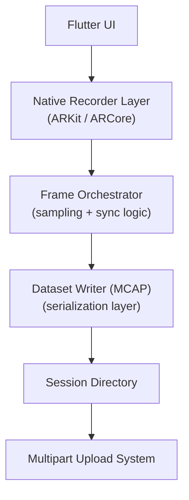
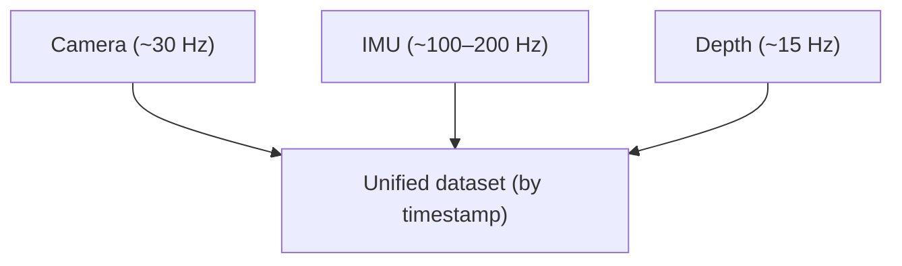

# this started as "just record ar"

i thought this would be easy.

> open ar session → capture frames → save → upload. done.

then reality hit:

- camera → around 30 fps
- imu → 100 to 200 hz
- depth → around 15 hz
- tracking randomly pauses
- ios and android behave differently

and suddenly nothing lines up.

<Callout type="note" title="the core realization">
this is not a camera problem. this is a **time synchronization problem** across multiple asynchronous streams.
</Callout>

# system architecture

here is the actual system we ended up building:



each layer has one job:

<Cards>
  <Card title="native" description="capture raw frames + sensor data" />
  <Card title="orchestrator" description="sampling and sync decisions" />
  <Card title="writer" description="serialize into structured format" />
  <Card title="upload" description="reliability and recovery" />
</Cards>

this separation is what made the system stable.

# the core loop (this is everything)

this runs around 30 times per second:

```kotlin title="RecordingFrameOrchestrator.kt"
val shouldSample = isTracking && frameSampler.shouldEncodeFrame(timestamp)
if (shouldSample) {
  val pose = frameProcessor.extractPose(camera)
  datasetWriter.writePoseRow(timestamp, pose, trackingState)

  val pointCloud = frameProcessor.extractPointCloudFrame(frame, timestamp)
  datasetWriter.writePointCloud(timestamp, pointCloud)

  val depth = frameProcessor.extractDepthImage(frame)
  datasetWriter.writeDepthFrame(timestamp, depth)

  val jpeg = eglManager.renderCameraToJpeg(...)
  datasetWriter.writeCompressedRgbFrame(timestamp, jpeg)
}

val imuSamples = imuCollector.drainSamples()
datasetWriter.writeImuSamples(imuSamples)
```

this loop is your ground truth generator.

# deterministic sampling (the real unlock)

initially we did:

> if a frame arrives → record it

this breaks instantly.

## the correct model

```text title="FrameSamplerImpl.kt"
elapsed = timestamp - sessionStart - trackingPauseOffset
expectedFrames = floor(elapsed / frameInterval) + 1
if expectedFrames > deterministicFrameIndex:
  deterministicFrameIndex = expectedFrames
  encode
else:
  skip
```

## why this matters

```text
Time →
│----│----│----│----│
  t0   t1   t2   t3

Only sample at boundaries
```

this gives you:

- device-independent datasets
- stable cadence (15 hz, 30 hz)
- zero long-term drift

# what ar frameworks actually give you

both arkit and arcore are doing slam:

- visual tracking (camera)
- inertial tracking (imu)
- map reconstruction

they output:

- pose (6dof)
- camera frame
- feature points
- depth (if available)

<Callout type="warning">
these are **not** synchronized streams.
</Callout>

# the real problem: multi-rate data



everything must align on timestamp, not frame index.

# deep dive: mcap (why this was a game changer)

we moved from a folder of loose files:

```text
frames/
imu.csv
pose.csv
depth/
```

to a single container:

```text
session.mcap
```

## what mcap actually is

mcap is a container format for heterogeneous timestamped data ([mcap.dev][1]). it's not encoding — it wraps multiple streams into one file.

## why it exists

before mcap:

- ros bags (hard to use outside ros)
- sqlite logs (not self-contained)
- custom formats (painful)

mcap solves this by being:

<Cards>
  <Card title="self-contained" description="everything in one file" />
  <Card title="multi-stream" description="multiple topics, one container" />
  <Card title="indexed" description="seek by topic or timestamp" />
  <Card title="append-only" description="recoverable after crashes" />
</Cards>

## mcap mental model

```text
session.mcap
  ├── /camera/pose
  ├── /device/imu
  ├── /camera/rgb
  ├── /camera/depth
  └── metadata
```

each stream = topic. each entry = timestamped message.

## actual file structure (internal)

```text
[Magic]
[Header]
[Data Section]
   ├── Chunk
   │     ├── Message
   │     ├── Message
   │     └── ...
[Summary / Index]
[Footer]
[Magic]
```

## key concept: records

mcap is built from records:

- **schema** → defines structure
- **channel** → defines topic
- **message** → actual data
- **chunk** → batch of messages
- **index** → fast lookup

([Monday Morning Haskell][3])

# why chunking matters

```text
Incoming Data
   │
   ▼
Buffer (chunk)
   │
   ├── flush → disk
   └── continue
```

our system:

- android → around 1 mb chunks
- ios → around 512 kb

this gives:

- high write throughput
- fewer disk ops
- recoverable files

<Callout type="tip">
mcap's append-only design even allows recovery after crashes ([Foxglove][2]).
</Callout>

# indexing (this is huge)

<Compare
  leftTitle="without index"
  rightTitle="with index"
  left={<p>scan entire file → find data</p>}
  right={<p>jump → read exact time range</p>}
/>

mcap supports:

- topic-based lookup
- timestamp-based seeking
- partial reads over network ([Segments.ai][4])

this is critical when files are 500 mb and larger, or when data is remote.

# serialization layer (ros2 + cdr)

our pipeline uses ros2 message schemas with cdr encoding.

cdr (common data representation) is a binary serialization format used by dds and ros2. it ensures cross-language compatibility.

so each message becomes:

```text
(topic, timestamp, binary payload)
```

# ios vs android architecture

<Tabs items={["Android (pull)", "iOS (push)"]}>
<Tab value="Android (pull)">

```kotlin title="ArSessionManagerImpl.kt"
while (true) {
    val frame = session.update()
    process(frame)
}
```

we drive the loop ourselves, so timing control is straightforward.

</Tab>
<Tab value="iOS (push)">

```swift title="ArSessionManagerImpl.swift"
func session(_ session: ARSession, didUpdate frame: ARFrame) {
    processingQueue.async {
        process(frame)
    }
}
```

the os pushes frames at us. we have to absorb whatever cadence ARKit decides on.

</Tab>
</Tabs>

## why this matters

| problem        | android | ios      |
| -------------- | ------- | -------- |
| timing control | easy    | hard     |
| buffering      | minimal | required |
| backpressure   | rare    | common   |

ios needs queues and backpressure handling. android can stay simpler.

# upload architecture

<Compare
  leftTitle="naive"
  rightTitle="actual"
  left={<p>file → upload → fail → restart from zero</p>}
  right={<p>split into 30mb chunks → parallel upload → retry failed parts → complete</p>}
/>

```text
MCAP File
   │
   ▼
Split (30MB chunks)
   │
   ▼
Parallel Upload
   │
   ▼
Retry Failed Parts
   │
   ▼
Complete Upload
```

## implementation idea

```dart title="uploads_service.dart"
final parts = splitFile(file, 30MB);

await Future.wait(parts.map(uploadPart));

await completeMultipartUpload();
```

this gives us resumability, parallelism, and reliability.

# hardest problems (real ones)

these took the most time:

<Steps>
  <Step>**imu and frame timestamp alignment** — different clocks, different cadences</Step>
  <Step>**tracking loss compensation** — slam pauses but the world keeps moving</Step>
  <Step>**deterministic sampling correctness** — off-by-one drifts compound over minutes</Step>
  <Step>**writer backpressure** — disk can't always keep up with the producer</Step>
  <Step>**storage exhaustion handling** — sessions die ugly when the device fills up</Step>
</Steps>

these are invisible in demos. but they define production systems.

# final takeaway

<Callout type="tip" title="the core idea">
**AR Recording ≠ video capture.**

AR Recording = a time-synchronized multi-stream system.
</Callout>

once you understand this:

- sampling becomes obvious
- mcap makes sense
- uploads become solvable

# closing

this started as "lets record ar". it became:

- real-time systems
- data engineering
- serialization design
- distributed uploads

and honestly, that's what made it worth building.

[1]: https://mcap.dev/guides "Introduction"
[2]: https://foxglove.dev/blog/introducing-the-mcap-file-format "Introducing the MCAP File Format - Foxglove"
[3]: https://mmhaskell.com/blog/2025/12/01/the-structure-of-an-mcap-file "The Structure of an MCAP File"
[4]: https://segments.ai/blog/mcap-vs-ros-bag-simplifying-multi-modal-sensor-data-in-robotics/ "MCAP vs ROS bag: Simplifying Multi-Modal Sensor Data in Robotics"
