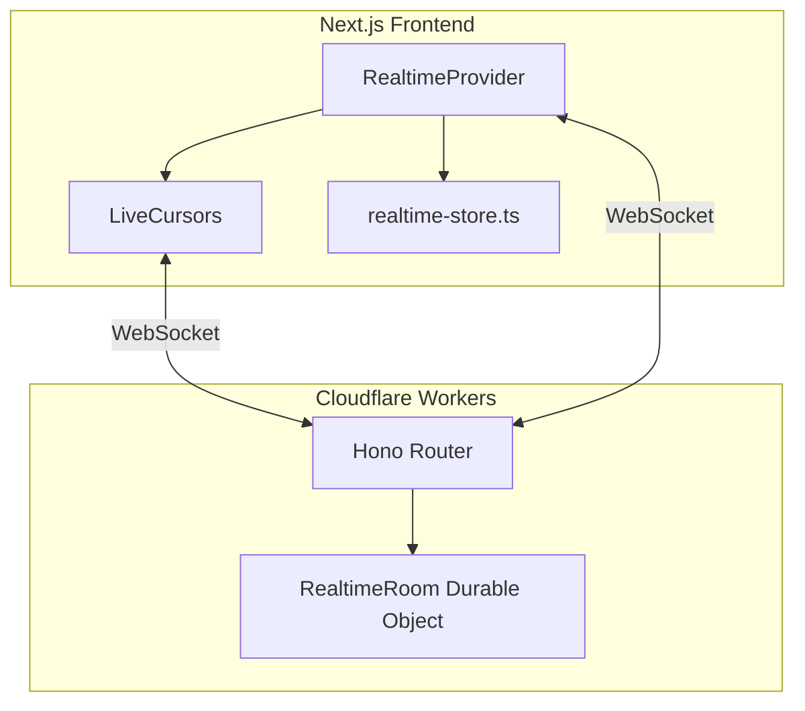
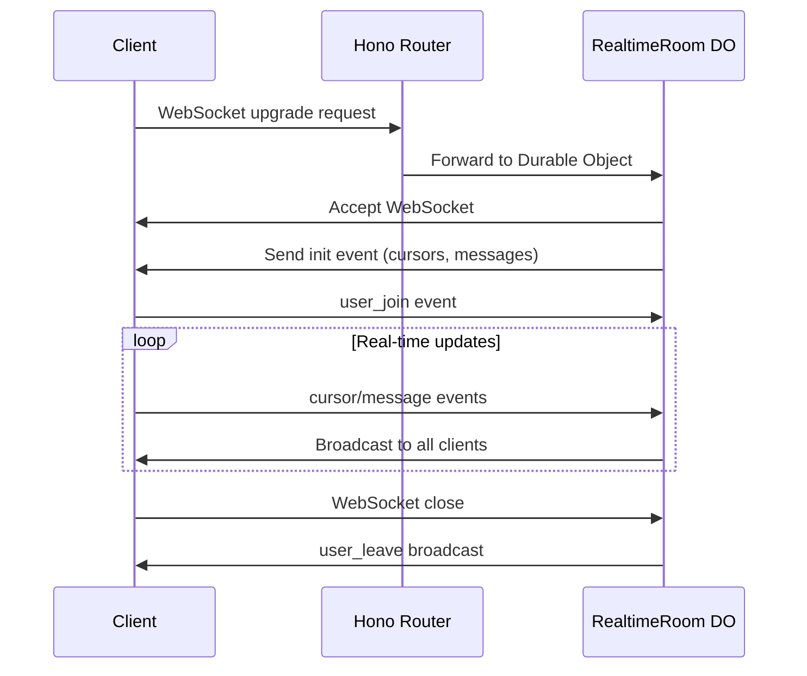

# Real-time Collaborative Cursors & Chat Architecture

This document provides a comprehensive overview of the real-time cursor and chat system architecture, including a senior developer code review with recommendations.

---

## 🏗️ Architecture Overview

This is a **real-time collaborative cursor and chat system** built with a clean client-server architecture using **WebSockets**.



---

## 📁 Component Breakdown

| Layer                | File                                  | Responsibility                                              |
| -------------------- | ------------------------------------- | ----------------------------------------------------------- |
| **Types/Utils**      | `lib/realtime-store.ts`               | Shared types, identity generation (names, colors, user IDs) |
| **State Management** | `lib/providers/realtime-provider.tsx` | WebSocket connection, state sync, React context             |
| **UI**               | `components/live-cursors.tsx`         | Cursor rendering, chat input, position tracking             |
| **Backend Router**   | `backend/src/index.ts`                | Hono app routing to Durable Objects                         |
| **Backend State**    | `backend/src/durable-objects.ts`      | Real-time state, message broadcasting                       |
| **Backend Types**    | `backend/src/types.ts`                | Server-side type definitions                                |

---

## 🔄 Data Flow

### Connection Lifecycle



### Event Types

| Event Type   | Direction                   | Description                                        |
| ------------ | --------------------------- | -------------------------------------------------- |
| `init`       | Server → Client             | Initial state with all cursors and recent messages |
| `cursor`     | Bidirectional               | Cursor position updates                            |
| `message`    | Bidirectional               | Chat messages                                      |
| `user_join`  | Client → Server → Broadcast | User connection announcement                       |
| `user_leave` | Server → Clients            | User disconnection                                 |

---

## 🎯 Key Features

### Frontend Features

- **Cursor Position Tracking**: Uses `requestAnimationFrame` for smooth 120fps updates
- **Anchor-based Positioning**: Cursors can anchor to DOM elements for scroll stability
- **Touch Device Support**: Different UX for mobile with virtual cursor positioning
- **Chat Mode**: Press `/` to enter chat mode on desktop, floating button on mobile
- **Identity Persistence**: User identity stored in localStorage
- **Heartbeat System**: 5-second heartbeat to maintain connection
- **Message Expiry**: Messages expire after 30 seconds

### Backend Features

- **Durable Objects**: Persistent WebSocket state management
- **Auto-cleanup**: Inactive users removed after 30 minutes
- **Message History**: Last 50 messages retained
- **Broadcast System**: Efficient message distribution to all connected clients

---

## 👍 What's Done Well

### 1. Clean Separation of Concerns

The architecture properly separates:

- Type definitions (`realtime-store.ts`, `types.ts`)
- Connection management (`realtime-provider.tsx`)
- UI rendering (`live-cursors.tsx`)
- Server state (`durable-objects.ts`)

### 2. Good Use of Cloudflare Durable Objects

Using Durable Objects for WebSocket state provides:

- Persistent in-memory state
- Automatic WebSocket hibernation support
- Easy broadcasting via `state.getWebSockets()`

### 3. Performance Optimizations

- `requestAnimationFrame` for smooth cursor updates
- Throttling (8ms ≈ 120fps)
- `will-change-transform` CSS optimization
- Passive event listeners
- GPU-accelerated transforms with `translate3d`

### 4. Thoughtful UX Details

- Touch device detection with different UX
- Virtual position for mobile chat users
- Heartbeat every 5s for connection health
- 30-minute inactivity cleanup
- Anchor-based positioning for scroll stability

### 5. User Identity Persistence

Smart localStorage-based identity that persists across sessions:

```typescript
const identity = localStorage.getItem(STORAGE_KEY);
```

---

## 🔴 Code Review: Issues & Recommendations

### High Priority

#### 1. Type Duplication ⚠️

**Issue**: Types are duplicated between frontend (`realtime-store.ts`) and backend (`types.ts`).

**Location**:

- `lib/realtime-store.ts`
- `backend/src/types.ts`

**Impact**: Maintenance burden, potential for inconsistencies

**Recommendation**: Create a shared types package:

```
packages/
  shared-types/
    src/
      index.ts  # All shared types
```

Or use a `shared/` folder with path aliases.

---

#### 2. Missing Durable Object Export ⚠️

**Issue**: The `RealtimeRoom` class is used but not exported from entry point.

**Location**: `backend/src/index.ts`

**Current Code**:

```typescript
export default app;
// Missing: export { RealtimeRoom } from "./durable-objects";
```

**Fix**:

```typescript
export default app;
export { RealtimeRoom } from "./durable-objects";
```

---

#### 3. Leaking setInterval in Durable Object ⚠️

**Issue**: The cleanup interval is never cleared on DO eviction.

**Location**: `backend/src/durable-objects.ts:23`

**Current Code**:

```typescript
this.cleanupInterval = setInterval(() => {
  this.cleanupInactiveUsers();
}, CLEANUP_INTERVAL_MS);
```

**Recommendation**: Use Cloudflare's alarm API instead:

```typescript
async alarm() {
  this.cleanupInactiveUsers();
  // Schedule next cleanup
  await this.state.storage.setAlarm(Date.now() + CLEANUP_INTERVAL_MS);
}
```

---

### Medium Priority

#### 4. No Message Validation on Backend

**Issue**: Messages from clients are parsed but never validated.

**Location**: `backend/src/durable-objects.ts:102`

**Current Code**:

```typescript
const data = JSON.parse(message as string) as RealtimeEvent;
// No validation
```

**Recommendation**: Use Zod for runtime validation:

```typescript
import { z } from "zod";

const cursorEventSchema = z.object({
  type: z.literal("cursor"),
  payload: z.object({
    userId: z.string(),
    name: z.string(),
    color: z.string(),
    percentX: z.number(),
    percentY: z.number(),
    // ...
  }),
});
```

---

#### 5. Race Condition in sendCursorPosition

**Issue**: If connection is down, cursor update is silently dropped.

**Location**: `lib/providers/realtime-provider.tsx:245`

**Current Code**:

```typescript
if (!isConnected || wsRef.current?.readyState !== WebSocket.OPEN) {
  connect();
  return; // Update lost!
}
```

**Recommendation**: Queue pending updates:

```typescript
const pendingUpdatesRef = useRef<CursorPayload[]>([]);

// In connect() onopen callback:
ws.onopen = () => {
  // Flush pending updates
  pendingUpdatesRef.current.forEach((payload) =>
    ws.send(JSON.stringify(payload))
  );
  pendingUpdatesRef.current = [];
};
```

---

#### 6. Unnecessary State Causing Re-renders

**Issue**: `displayPos` state triggers re-renders on every mouse move.

**Location**: `components/live-cursors.tsx:83`

**Current Code**:

```typescript
const [displayPos, setDisplayPos] = useState({ x: 0, y: 0 });
setDisplayPos({ x: clientX, y: clientY }); // Causes re-render!
```

**Recommendation**: Use ref with direct DOM manipulation:

```typescript
const cursorRef = useRef<HTMLDivElement>(null);

// In RAF callback:
if (cursorRef.current) {
  cursorRef.current.style.transform = `translate3d(${x}px, ${y}px, 0)`;
}
```

---

#### 7. Magic Numbers Scattered

**Issue**: Timing constants are duplicated across files.

**Locations**:

- `live-cursors.tsx:15` → `MESSAGE_EXPIRY = 30000`
- `realtime-provider.tsx:55` → `MESSAGE_EXPIRY_MS = 30000`
- `durable-objects.ts:3` → `INACTIVITY_TIMEOUT_MS = 30 * 60 * 1000`

**Recommendation**: Create shared constants:

```typescript
// lib/constants.ts (or shared package)
export const REALTIME_CONSTANTS = {
  MESSAGE_EXPIRY_MS: 30_000,
  INACTIVITY_TIMEOUT_MS: 30 * 60 * 1000,
  HEARTBEAT_INTERVAL_MS: 5_000,
  CURSOR_THROTTLE_MS: 8,
  MAX_MESSAGES: 50,
};
```

---

### Low Priority

#### 8. No WebSocket Reconnection Backoff

**Issue**: Fixed 3s retry can hammer server during outages.

**Location**: `lib/providers/realtime-provider.tsx:189`

**Current Code**:

```typescript
reconnectTimeoutRef.current = setTimeout(connect, 3000);
```

**Recommendation**: Exponential backoff:

```typescript
const retryCountRef = useRef(0);

ws.onclose = () => {
  const delay = Math.min(1000 * Math.pow(2, retryCountRef.current), 30000);
  retryCountRef.current++;
  reconnectTimeoutRef.current = setTimeout(connect, delay);
};

ws.onopen = () => {
  retryCountRef.current = 0; // Reset on success
};
```

---

#### 9. Frequent Event Handler Re-registration

**Issue**: `handleKeyDown` effect re-registers on every `currentMessage` change.

**Location**: `components/live-cursors.tsx:259-312`

**Recommendation**: Use ref for current message:

```typescript
const currentMessageRef = useRef(currentMessage);
currentMessageRef.current = currentMessage;

// In handler, read from ref instead of closure
```

---

## 📊 Summary Scorecard

| Category        | Rating    | Notes                                           |
| --------------- | --------- | ----------------------------------------------- |
| Architecture    | ⭐⭐⭐⭐☆ | Clean separation, good patterns                 |
| Type Safety     | ⭐⭐⭐☆☆  | Good types, but duplication issue               |
| Performance     | ⭐⭐⭐⭐☆ | Good optimizations, minor improvements possible |
| Security        | ⭐⭐☆☆☆   | Needs input validation                          |
| Maintainability | ⭐⭐⭐☆☆  | Magic numbers, duplicated code                  |
| Error Handling  | ⭐⭐⭐☆☆  | Basic try/catch, could be more robust           |

---

## 🚀 Quick Start

### Development

```bash
# Start frontend
npm run dev

# Start backend (in separate terminal)
cd backend && npx wrangler dev
```

### Deployment

```bash
# Deploy backend to Cloudflare
cd backend && npx wrangler deploy

# Deploy frontend (Vercel/etc)
npm run build && npm run deploy
```

---

## 📝 Environment Variables

| Variable             | Description          | Example                        |
| -------------------- | -------------------- | ------------------------------ |
| `NEXT_PUBLIC_WS_URL` | WebSocket server URL | `wss://stormej.workers.dev/ws` |

---

## 🔧 Configuration

### Cloudflare Wrangler (`backend/wrangler.jsonc`)

```jsonc
{
  "name": "stormej",
  "main": "src/index.ts",
  "durable_objects": {
    "bindings": [
      {
        "name": "REALTIME_ROOM",
        "class_name": "RealtimeRoom",
      },
    ],
  },
}
```

---

## 📚 Further Reading

- [Cloudflare Durable Objects](https://developers.cloudflare.com/durable-objects/)
- [Hono Framework](https://hono.dev/)
- [WebSocket API](https://developer.mozilla.org/en-US/docs/Web/API/WebSocket)
